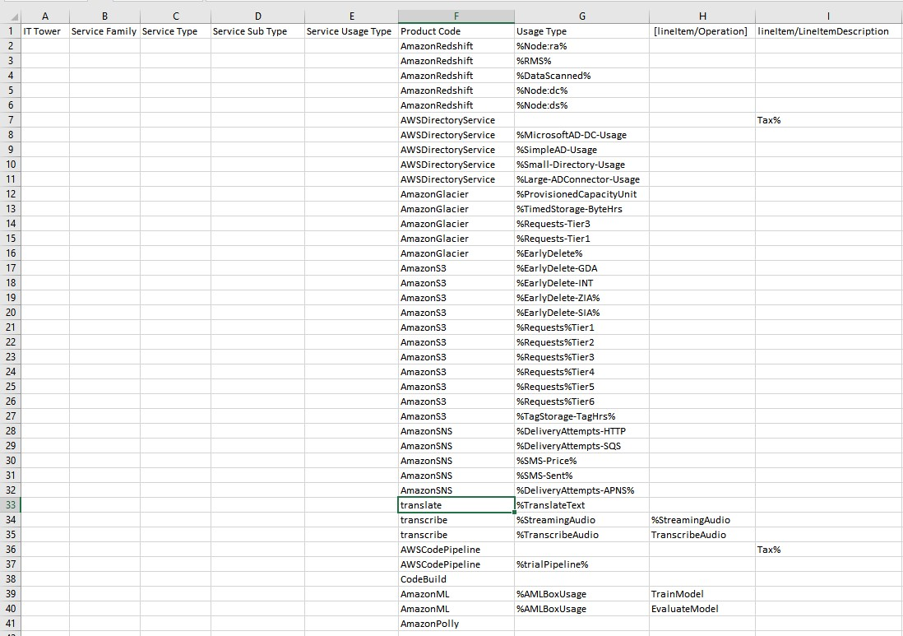
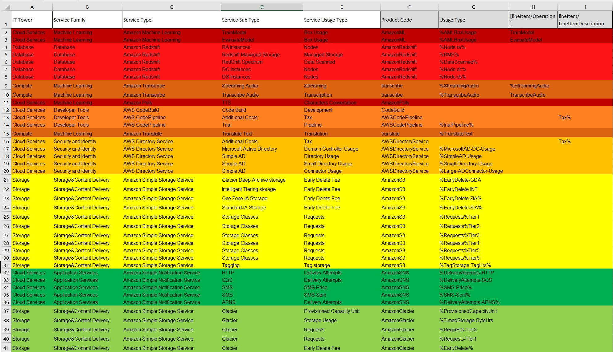

# Лабораторная работа 1. 
# Знакомство с IaaS, PaaS, SaaS сервисами в облаке на примере Amazon Web Services (AWS). Создание сервисной модели.

Вариант: 1

Выполнили:  Селищев Роман Александрович 334234

## Цель работы

Знакомство с облачными сервисами. Понимание уровней абстракции над инфраструктурой в облаке. Формирование понимания типов потребления сервисов в сервисной-модели. 

## Дано

1. Слепок данных биллинга от провайдера после небольшой обработки в виде SQL-параметров. Символ % в начале/конце означает, что перед/после него может стоять любой набор символов.
2. Образец итогового соответствия, что желательно получить в конце. В этом же документе

## Необходимо

1. Импортировать файл .csv в Excel или любую другую программу работы с таблицами. Для Excel делается на вкладке Данные – Из текстового / csv файла – выбрать файл, разделитель – точка с запятой.
2. Распределить потребление сервисов по иерархии, чтобы можно было провести анализ от большего к меньшему (напр. От всех вычислительных ресурсов Compute дойти до конкретного типа использования - Выделенной стойка в датацентре Dedicated host usage).
3. Сохранить файл и залить в соответствующую папку на Google Drive.

## Алгоритм работы: 

Сопоставить входящие данные от провайдера с его же документацией. Написать в соответствие колонкам справа значения 5 колонок слева, которые бы однозначно классифицировали тип сервиса. Для столбцов IT Tower и Service Family значения можно выбрать из образца.

## Начальная Таблица:

## Ход выполнения

1. импортируем .csv файл в Excel, фильтруем по Product code с отображением только уникальных и копируем список продуктов для дальнейшего поиска информации по ним в сети.

2. Далее для заполнение столбцов были найдены источники с информацией о сервисах amazon:
    1) https://docs.aws.amazon.com/
    2) https://aws.amazon.com/ (нужен VPN)
    3) https://aws-price-list-api-values.alanwsmith.com/
    
3. После сервисы были отсортированы по Иерархии от большего к меньшемупотреблению ресурсов. по IT Tower и Service Family делим на группы и окрашеваем в различные цвета.

## Описание сервисов

