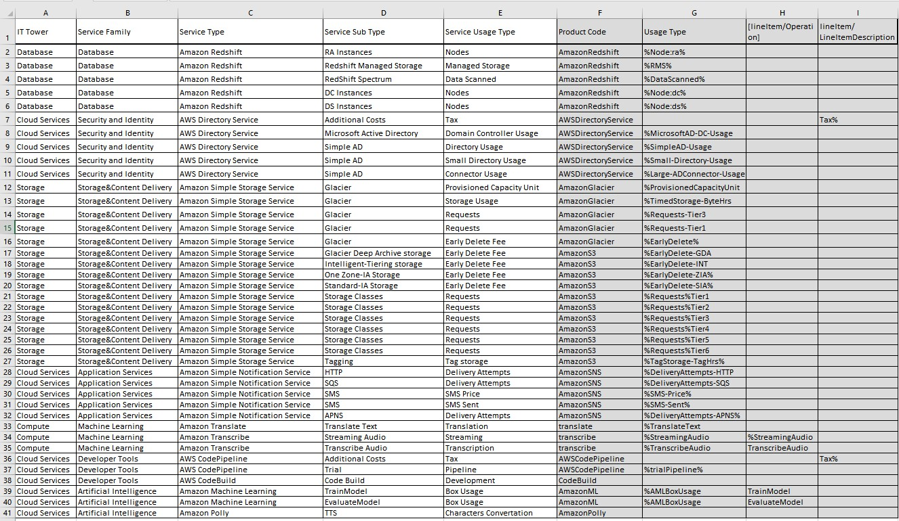

# Лабораторная работа 1. 
# Знакомство с IaaS, PaaS, SaaS сервисами в облаке на примере Amazon Web Services (AWS). Создание сервисной модели.

Вариант: 1

Выполнили:  Селищев Роман Александрович 334234

## Цель работы

Знакомство с облачными сервисами. Понимание уровней абстракции над инфраструктурой в облаке. Формирование понимания типов потребления сервисов в сервисной-модели. 

## Дано

1. Слепок данных биллинга от провайдера после небольшой обработки в виде SQL-параметров. Символ % в начале/конце означает, что перед/после него может стоять любой набор символов.
2. Образец итогового соответствия, что желательно получить в конце. В этом же документе

## Необходимо

1. Импортировать файл .csv в Excel или любую другую программу работы с таблицами. Для Excel делается на вкладке Данные – Из текстового / csv файла – выбрать файл, разделитель – точка с запятой.
2. Распределить потребление сервисов по иерархии, чтобы можно было провести анализ от большего к меньшему (напр. От всех вычислительных ресурсов Compute дойти до конкретного типа использования - Выделенной стойка в датацентре Dedicated host usage).
3. Сохранить файл и залить в соответствующую папку на Google Drive.

## Алгоритм работы: 

Сопоставить входящие данные от провайдера с его же документацией. Написать в соответствие колонкам справа значения 5 колонок слева, которые бы однозначно классифицировали тип сервиса. Для столбцов IT Tower и Service Family значения можно выбрать из образца.

## Начальная Таблица:

## Ход выполнения

1. импортируем .csv файл в Excel, фильтруем по Product code с отображением только уникальных и копируем список продуктов для дальнейшего поиска информации по ним в сети.

2. Далее для заполнение столбцов были найдены источники с информацией о сервисах amazon:
    1) https://docs.aws.amazon.com/
    2) https://aws.amazon.com/ (нужен VPN)
    3) https://aws-price-list-api-values.alanwsmith.com/

    
3. После сервисы были отсортированы по Иерархии от большего к меньшемупотреблению ресурсов. по IT Tower и Service Family делим на группы и окрашеваем в различные цвета.

## Описание сервисов

1. Amazon Translate — сервис машинного перевода, работающий в облаке. Поддерживает широкий спектр языков и обеспечивает быстрый и точный перевод текстов.

2. Amazon Transcribe — облачное решение для автоматического распознавания речи, применяющее алгоритмы машинного обучения для преобразования аудио-записей в текст.

3. Amazon S3 — объектное хранилище, предоставляющее масштабируемость, высокую доступность, надёжность и производительность для хранения любых данных.

4. Amazon Glacier — облачный сервис для долговременного архивного хранения данных с низкой стоимостью. Оптимизирован для редкого доступа и обеспечивает безопасное хранение больших объёмов информации при минимальных затратах.

5. Amazon SNS — облачный сервис для отправки уведомлений и сообщений пользователям или приложениям через различные каналы, включая SMS, email, мобильные push-уведомления, а также через различные протоколы для интеграции с приложениями.

6. AWS CodePipeline — инструмент для организации процесса непрерывной доставки: помогает моделировать, визуализировать и автоматизировать этапы разработки и развертывания приложений.

7. AWS CodeBuild — облачный сервис для CI/CD, позволяющий развертывать приложения, обеспечивая автоматизацию шагов разработки, тестирования и развертывания.

8. Amazon Machine Learning — платформа для построения, обучения и применения моделей машинного обучения в облачной среде.

9. Amazon Polly — облачный сервис, который преобразует текстовые данные в естественно звучащую речь.

10. AWS Directory Service — решение для развертывания и администрирования пользовательских директорий (например, Active Directory) в облачной инфраструктуре.

11. Amazon Redshift — облачная система управления базами данных, ориентированная на хранение и анализ больших массивов информации с высокой скоростью обработки.