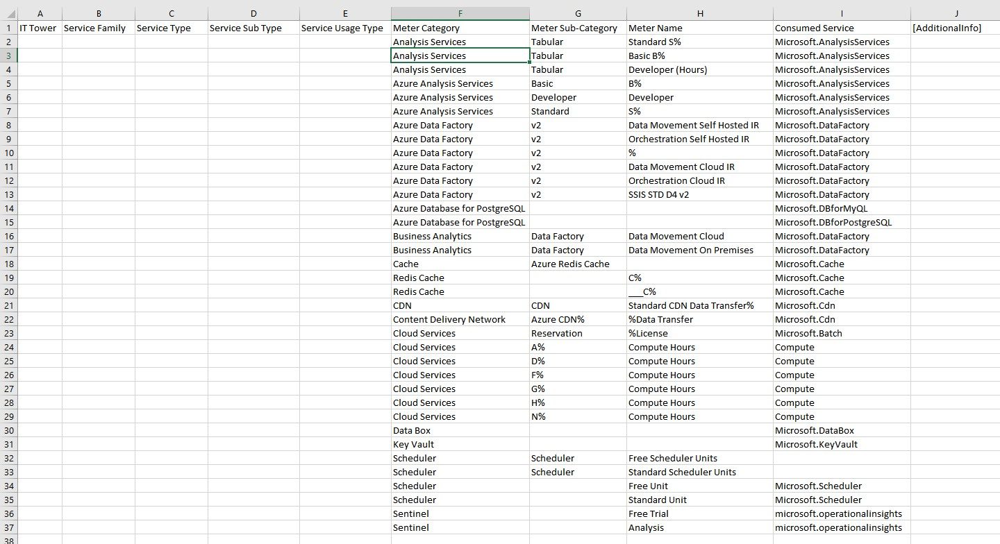
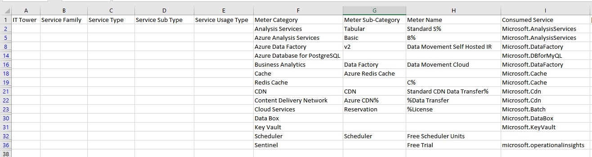
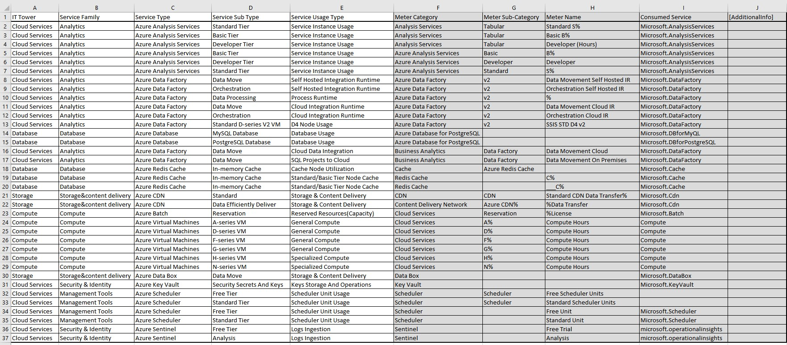
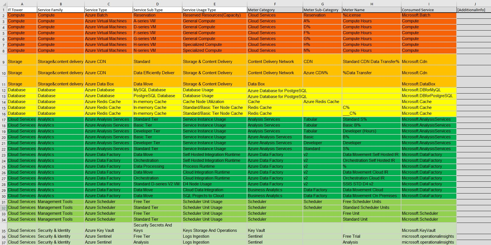

# Лабораторная работа 2. 
# Сравнение сервисов Amazon Web Services и Microsoft Azure. Создание единой кросс-провайдерной сервисной модели.

Вариант: 1

Выполнили:  Селищев Роман Александрович 334234

## Цель работы

Цель работы: Получение навыков аналитики и понимания спектра публичных облачных сервисов без привязки к вендору. Формирование у студентов комплексного видения Облака. 

## Дано

Данные лабораторной работы 1.
1. Слепок данных биллинга от провайдера после небольшой обработки в виде SQL-параметров. Символ % в начале/конце означает, что перед/после него может стоять любой набор символов
2. Образец итогового соответствия, что желательно получить в конце. В этом же документе

## Необходимо

1. Импортировать файл .csv в Excel или любую другую программу работы с таблицами. Для Excel делается на вкладке Данные – Из текстового / csv файла – выбрать файл, разделитель – точка с запятой.
2. Распределить потребление сервисов по иерархии, чтобы можно было провести анализ от большего к меньшему (напр. От всех вычислительных ресурсов Compute дойти до конкретного типа использования - Выделенной стойка в датацентре Dedicated host usage). При этом сохранять логическую концепцию, выработанную в Лабораторной работе 1.
3. Сохранить файл и залить в соответствующую папку на Google Drive.

## Алгоритм работы: 

Сопоставить входящие данные от провайдера с его же документацией. Написать в соответствие колонкам справа значения 5 колонок слева, которые бы однозначно классифицировали тип сервиса. Для столбцов IT Tower и Service Family значения можно выбрать из образца. В ходе выполнения работы не отходить от принципов классификации, выбранных в Лабораторной работе 1. Например, если сервис Машинного обучения был разбит на Вычислительные мощности и Облачные сервисы, то продолжать его разбивать и в новых данных.

## Начальная Таблица:

## Ход выполнения

1. импортируем .csv файл в Excel, фильтруем по Product code с отображением только уникальных и копируем список продуктов для дальнейшего поиска информации по ним в сети.

2. Далее заполняем столбцы, на основе данных из сети

    
3. После сервисы были отсортированы по Иерархии от большего к меньшемупотреблению ресурсов. по IT Tower и Service Family делим на группы и окрашеваем в различные цвета.

## Описание сервисов

1. Azure Analysis Services - облачная PaaS-платформа, предоставляющая корпоративные модели данных и средства аналитики на уровне предприятия.

2. Azure Data Factory - инструмент для интеграции и обработки данных, позволяющий извлекать, преобразовывать и загружать их в облаке с масштабированием без серверной инфраструктуры.

3. Azure Database - управляемая облачная база данных для хранения и работы с реляционной информацией, а также для построения аналитических отчётов.

4. Azure Redis Cache - сервис кэширования, который сохраняет часто используемые данные в памяти, ускоряя доступ, снижая нагрузку на основное хранилище и повышая производительность приложений.

5. AAzure CDN - глобальная сеть доставки контента, оптимизирующая быструю и надёжную доставку веб-ресурсов пользователям.

6. Azure Data Box - защищённое устройство с накопителями, предназначенное для переноса больших объёмов данных с локальной инфраструктуры в облако.

7. Azure Key Vault - решение для централизованного и безопасного управления секретами, ключами и сертификатами.

8. Azure Scheduler - сервис для планирования и автоматизации выполнения заданий в облаке, упрощающий управление задачами и контроль сроков их исполнения.

9. Azure Sentinel - Масштабируемая облачная информация о безопасности и управление событиями (SIEM), которая предоставляет интеллектуальное и комплексное решение для siEM и оркестрации безопасности, автоматизации и реагирования (SOAR).

10. Azure Batch -сервис для запуска и администрирования масштабных параллельных вычислений на кластерах виртуальных машин.

11. Azure Virtual Machines - облачный сервис, позволяющий разворачивать, конфигурировать и управлять виртуальными машинами для различных сценариев работы.