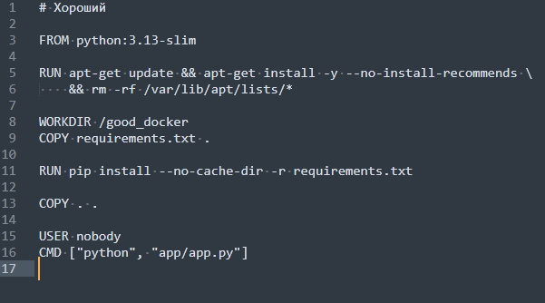

# DevOps

## Лабораторная работа №2

или Хороший, Плохой, Злой*

*для правильной хронологии необходимо начать ознокомления с лаб2 со здвездочкой

### Простое python-приложение

---

### "Плохой" Dockerfile

Напишем Dockerfile с плохими практиками:

requirements:

flask==2.2.5
python-dotenv==0.19.0

плохие практики :

* Выполнение множества команд RUN без объединения (создаёт лишние слои)

* Установка ненужных и неиспользуемых пакетов

* Использование одного только apt-get update в RUN приводит к проблемам с кэшированием и сбою последующих инструкций apt-get install. 

* Использование ADD вместо COPY для простого копирования файлов (лишние возможности, которые могут привести к ошибкам)

* Установка зависимостей после копирования всех файлов приложения Хранение конфиденциальной информации в слояхЗапуск от root пользователя (небезопасно)Использование устаревшего и неподдерживаемого базового образа

* FROM python:3.7 большой образ и не актуальной версии

---

### "Хороший" Dockerfile

> Написать “хороший” Dockerfile, в котором эти плохие практики исправлены

Теперь исправим все ошибки и напишем оптимизированный и безопасный Dockerfile:

Поясним, как именно были исправлены перечисленные плохие практики:

- Используется актуальный и легковесный образ `python:3.13-slim`, который более безопасен, т.к. поддерживается на текущий момент, и занимает меньше места, потому что содержит лишь самые необходимые компоненты для Python-приложений.
- Объединяем команды RUN
- Сначала копируем только файл зависимостей, чтобы сохранить кэш слоёв
- Копируем остальные файлы после установки зависимостей (чтобы изменения кода не пересобирали зависимости)
- Не сохраняем секреты в образе — они будут передаваться через переменные окружения
- Запуск от обычного пользователя для повышения безопасности
  
  

---

### Вывод

- **_Размер образа_**: 
  
  
  Плохой - 1.08гб  Я люблю таких кабанов. Когда они падают, то сильно гремят и почти никогда не встают.
  хороший - 0.13гб  у каждого образа свой звук, этот звучит неплохо

- **_Скорость сборки_**: уменьшение размера образа, отсутствие установки ненужных пакетов повлияли на скорость сборки, он теперь собирается намного быстрее:
  Плохой - 34с
  хороший - 13с

- Видишь ли, мой друг, есть два вида образов: те, которые союираются через дверь, и те, которые союираются через окно.

- 
  
  

- **_Безопасность_**: в хорошем образе уровнь безопасности выше: используется актуальная версия, пользователь без прав администратора, а конфиденциальные данные не хранятся в слоях образа. Ниже можно увидеть, как выводится информация при запуске контейнеров на основе старого и нового образов без указания дополнительных параметров (кроме порта):
  `docker run -p 5000:5000 bad_image`
  `

- docker run -p 5000:5001 good_image`
  

- Как видно из примера, в плохом образе токен можно легко получить, так как он был добавлен непосредственно в образ. В хорошем же сценарии токена нет, поскольку мы его не передавали. Давайте теперь передадим токен во время запуска контейнера через переменные окружения.
  `docker run -p 5002:5000 -e SECRET_TOKEN=my_secret_token good_image`
  

- Таким образом, токен мы можем получить только, если сами его передадим при запуске контейнера.

- **_Скорость пересборки_**: изменим код приложения
  Плохой - 5.3с
  хороший - 0.7с

- 

- 

- Хороший - самый быстрый на диком западе

---

### Плохие практики при работе с контейнерами

Если работаешь, чтобы жить — зачем убиваться на работе?

* Не стоит полагаться исключительно на централизованное логирование для работы с контейнерными логами. В Docker уже есть встроенные механизмы для их просмотра. Например, можно воспользоваться командой `docker logs [container-id]`. Для отображения логов в реальном времени предусмотрен флаг `-f` или `--follow`: docker logs -f [container-id]
  Однако в масштабных системах с множеством контейнеров централизованное логирование становится необходимым. Оно позволяет собирать данные из разных источников в одном месте, упрощая анализ и мониторинг. Решения вроде **ELK Stack** или **Graylog** дают возможность отслеживать аномалии, настраивать оповещения и оперативно реагировать на ошибки, сбои или угрозы безопасности.

* Также важно правильно подходить к сетевой конфигурации контейнеров. Отсутствие сетевой изоляции позволяет им бесконтрольно взаимодействовать друг с другом, что повышает риск утечек данных и атак. Для повышения безопасности рекомендуется создавать пользовательские сети и чётко определять, какие контейнеры могут обмениваться информацией. Для удобства можно использовать **Docker Compose**: он автоматически формирует изолированную сеть для сервисов, описанных в `docker-compose.yml`, и обеспечивает их взаимодействие по имени сервиса без необходимости вручную указывать IP-адреса и порты.
