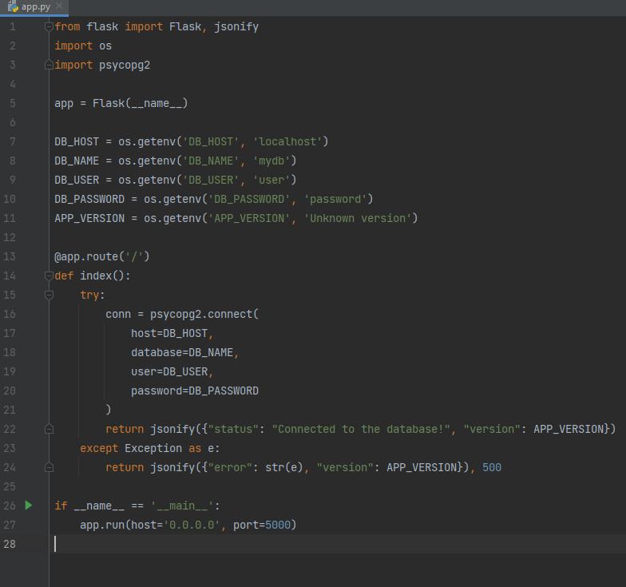
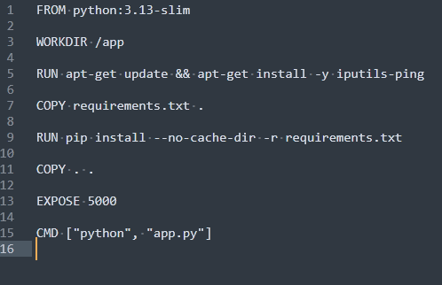
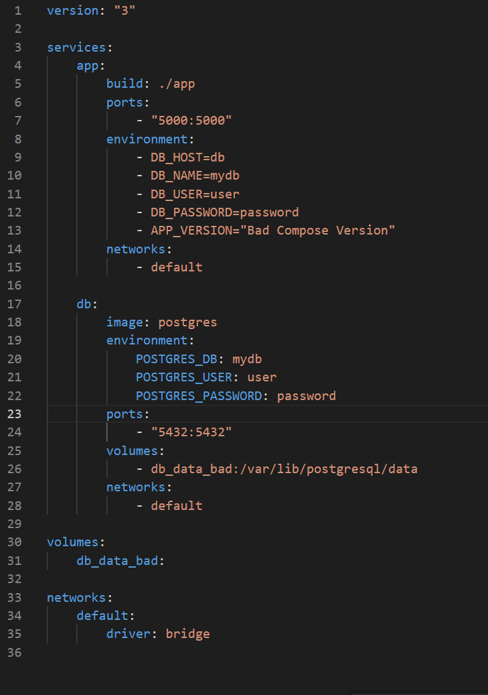
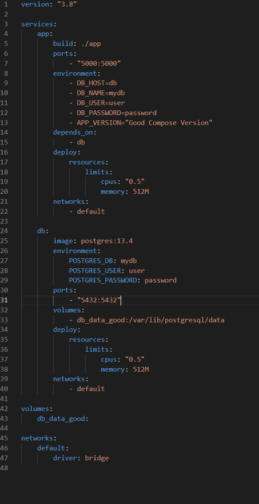
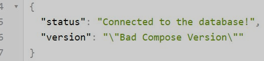
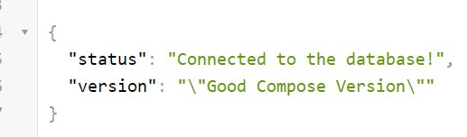
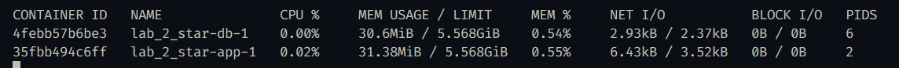
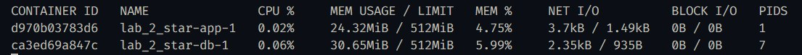
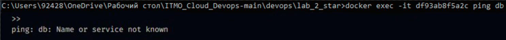
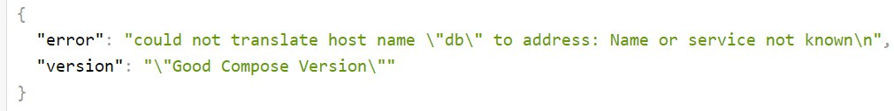

# Лаб2*

---

Dockerfile для приложения:

### "Злой" Docker Compose file

- Неявное указание версии образа базы данных

- Если в конфигурации сервиса `db` не задана конкретная версия образа, Docker будет использовать последнюю доступную. Это может привести к проблемам совместимости, так как новая версия базы данных способна содержать изменения, несовместимые с приложением.

- Отсутствие зависимости между сервисами:
  
  - При отсутствии директивы `depends_on` порядок запуска контейнеров не гарантируется. В результате приложение может попытаться подключиться к базе данных до того, как она будет полностью инициализирована, что вызовет ошибки при установлении соединения.

- нет ограничений ресурсов:
  
  - в текущем файле не заданы лимиты по CPU и памяти для сервисов. Это означает, что контейнеры смогут бесконтрольно потреблять ресурсы хоста, что в свою очередь может негативно сказаться на производительности других приложений и сервисов. Для предотвращения таких ситуаций рекомендуется задавать лимиты с помощью секции `deploy.resources.limits`.

---

### "Хороший" Docker Compose file

- Указана конкретная версия образа базы данных — `postgres:13.4`.
- Добавлена директива `depends_on`, обеспечивающая запуск контейнера с БД до старта приложения.
- Для сервисов заданы ограничения на использование CPU и оперативной памяти.

---

### Просмотр работы контейнеров

собираем контейнеры и запускаем:

`docker-compose -f docker-compose.good.yml build`

`docker-compose -f docker-compose.bad.yml build`

`docker-compose -f docker-compose.bad.yml up`

`docker-compose -f docker-compose.good.yml up`

показатели запущенных контейнеров:

злой :

хороший:

Команды для остановки контейнеров:

`docker-compose -f docker-compose.good.yml down`

`docker-compose -f docker-compose.bad.yml down`

---

### Настройка сетевой изоляции

Настроим сетевую изоляцию в Docker Compose. В исходной конфигурации её нет, поэтому контейнеры могут свободно обмениваться данными друг с другом, включая пересылку пакетов:

после пересборки и запуска не пингуется

**_Итог:_** с помощью Docker Compose удалось успешно развернуть небольшое веб-приложение и выполнить базовые настройки контейнера с использованием современных инструментов. Мы освоили эффективные подходы к работе с Docker Compose и правильную настройку взаимодействия контейнеров внутри сети.
