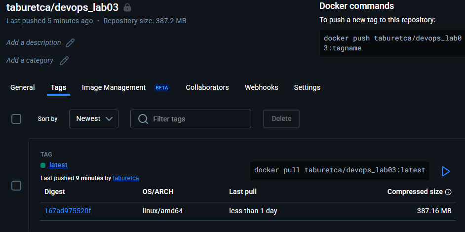

# Лабораторная работа №3

Задание: Cделать, чтобы после пуша в ваш репозиторий автоматически собирался докер образ и результат его сборки сохранялся куда-нибудь. (например, если результат - текстовый файлик, он должен автоматически сохраниться на локальную машину, в ваш репозиторий или на ваш сервер).

1) Для удобной работы создаем [отдельный репозиторий](https://github.com/RomanSelischev/Devops_lab03_rep), в котором и будет выполняться задание

2) Создаем файл .yml в дирректории .github/workflows, с помощью которого и будет осуществляться пуш сборки на Docker Hub после пуша в репозитории.
   
    хорошая:
   
   
      плохая:

3) Плохие практики в CI/CD и их исправления

4) * **Логин и пароли в коде**  
     В плохом примере логин и токен Docker Hub были указаны прямо в workflow.  
     **Почему плохо:** секреты могут быть слиты и использованы злоумышленниками.  
     **Как исправить:** хранить секреты в CI/CD секретах, например, в GitHub Secrets (`${{ secrets.LOGIN }}` и `${{ secrets.PASSWORD }}`).
   
   * **Использование `latest` для Docker образа**  
     В плохом примере образ пушился с тегом `latest`.  
     **Почему плохо:** нет контроля версий образов, сборка может непредсказуемо обновиться.  
     **Как исправить:** использовать фиксированные теги, например `v1.0.0`.
   
   * **Игнорирование ошибок с `continue-on-error: true`**  
     В плохом примере добавляли `continue-on-error: true`.  
     **Почему плохо:** ошибки сборки или пуша игнорируются, workflow может завершиться успешно, хотя процесс не удался.  
     **Как исправить:** не использовать `continue-on-error`, позволять workflow падать при ошибках.
   
   * **Использование `npm install` вместо `npm ci`**  
     В плохом примере зависимости устанавливали через `npm install`.  
     **Почему плохо:** может перезаписываться `package-lock.json`, версии зависимостей между средами могут расхождаться, повышается риск выполнения вредоносного кода.  
     **Как исправить:** использовать `npm ci --ignore-scripts` для безопасной и стабильной установки зависимостей.
   
   * **Прямое хардкодирование Dockerfile и контекста**  
     В плохом примере `file` и `context` были захардкожены.  
     **Почему плохо:** снижает гибкость workflow, трудно использовать другой путь или репозиторий.  
     **Как исправить:** явно указывать `file` и `context`, но лучше через переменные или относительные пути, чтобы workflow был гибким и переносимым.

5) После внесённых изменений время установки зависимостей сократилось, CI/CD файл стал более гибким и теперь позволяет легко изменять сервер и пути через переменные окружения без необходимости редактировать сам файл. Кроме того, повысилась безопасность, так как секреты больше не сохраняются в репозитории или логах CI/CD. (Пример запуска рабочего процесса приведён ниже, в лабораторной со звёздочкой).

6) Чтобы войти в аккаунт репозитория Docker Hub с нашего репозитория были сгенерированы секреты LOGIN  (логин в Docker Hub) и PASSWORD (токен с Docker Hub).
   
   Добавляем teor.py и dockerfile, после пуша видим, что сборка осуществилась и выгрузилась в Docker Hub

